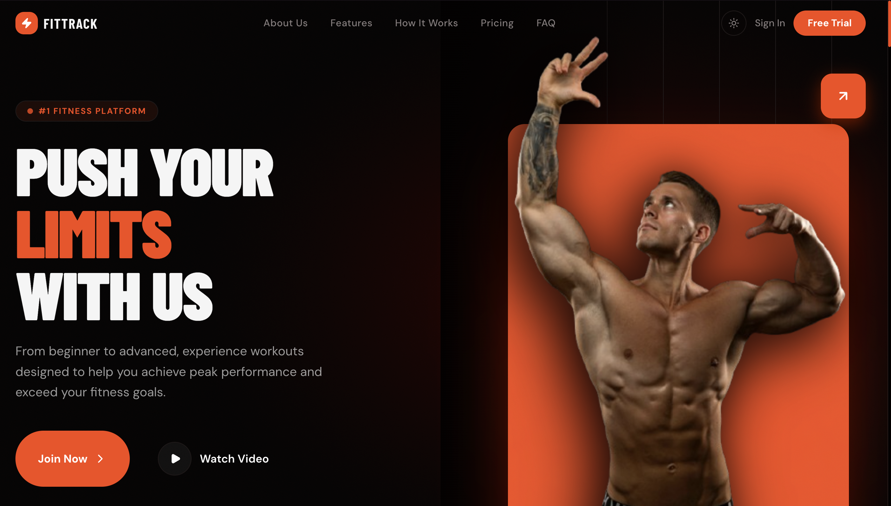
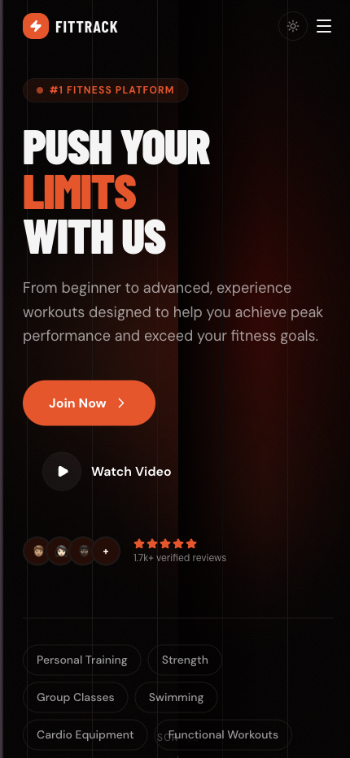
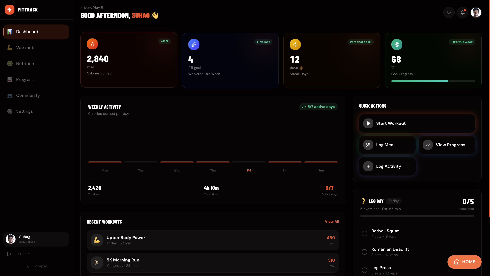
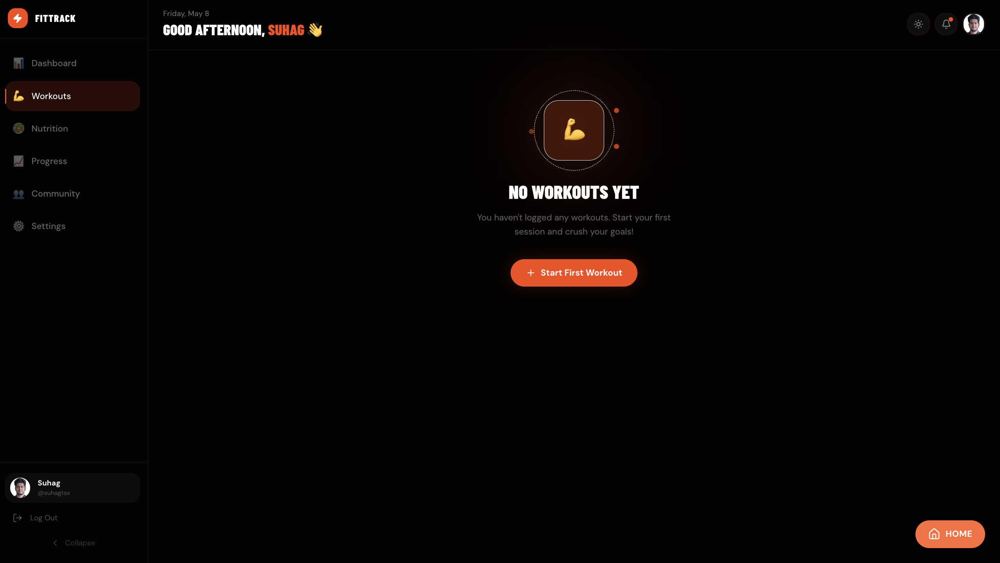
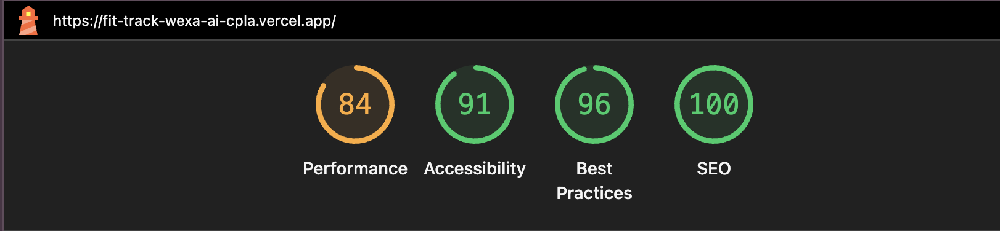
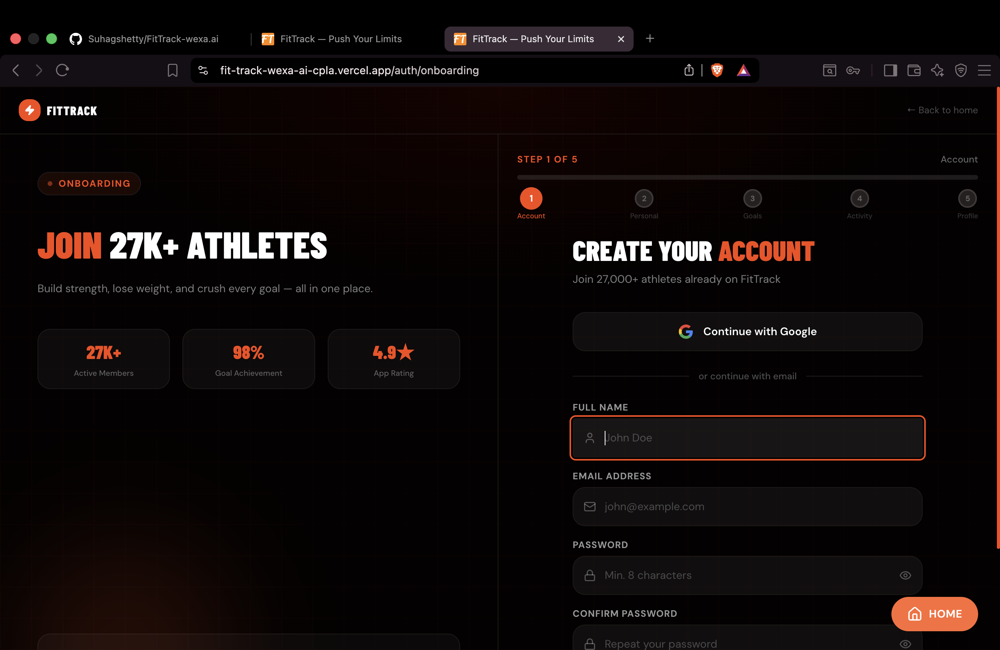
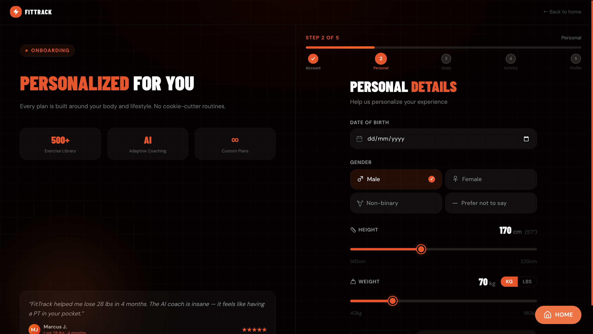
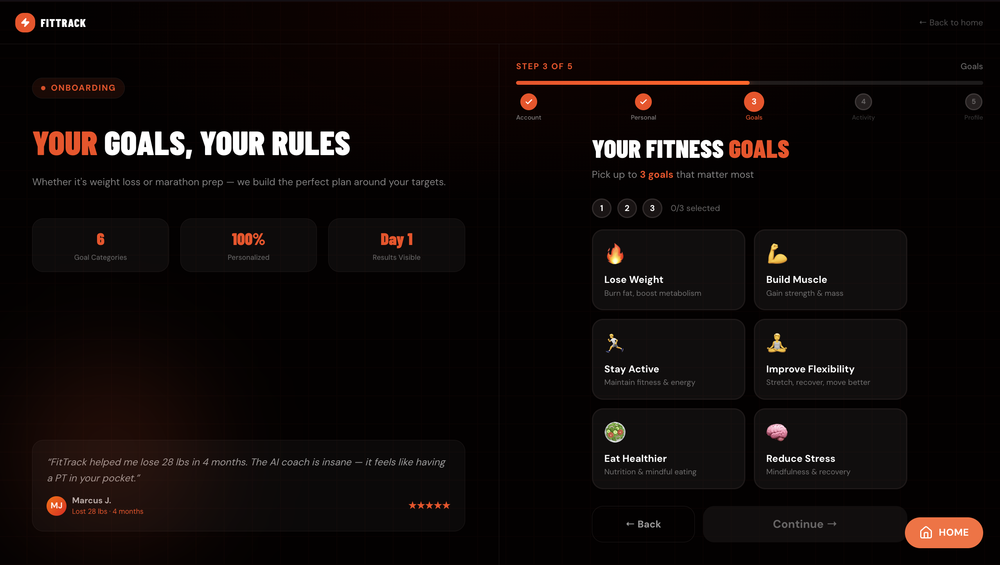
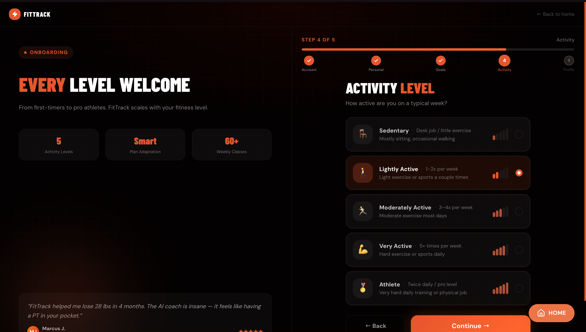
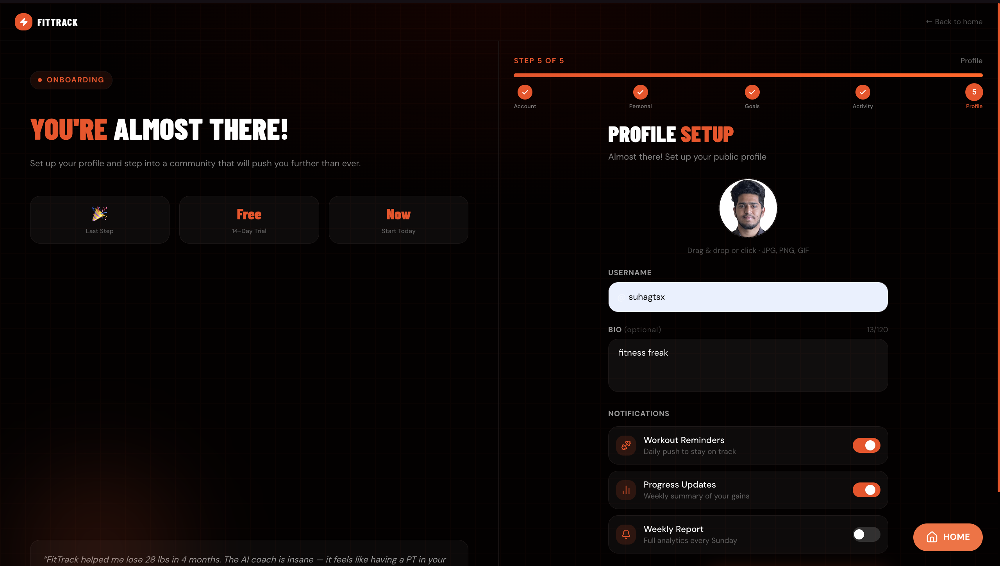

# FitTrack — Push Your Limits

> Premium fitness & wellness platform built with Next.js 16, TypeScript, Tailwind CSS v4, and Framer Motion.

---

## Screenshots

### Landing Page — Desktop


### Mobile View


### Dashboard


### Dashboard — Workout View


### Lighthouse Score


### Onboarding Flow






---

## Live Demo

🔗 [fittrack-wexa.vercel.app](https://fit-track-wexa-ai-cpla.vercel.app/)

---

## Getting Started

```bash
npm install
npm install canvas-confetti @types/canvas-confetti
npm run dev
```

Open/localhost:3000](http://localhost:3000)


## Routes

| Route | Description |
|---|---|
| `/` | Landing page |
| `/auth/onboarding` | 5-step onboarding flow |
| `/dashboard` | User fitness dashboard |

---

## Tech Stack

| Category | Technology |
|---|---|
| Framework | Next.js 16 App Router |
| Language | TypeScript |
| Styling | Tailwind CSS v4 |
| Animations | Framer Motion (LazyMotion) |
| Forms | React Hook Form + Zod |
| State Management | Zustand |
| Icons | Lucide React |
| Fonts | Barlow Condensed, DM Sans (next/font) |

---

## Features

### Landing Page
- Premium hero section with fitness trainer illustration
- Animated statistics counter section
- Feature showcase with hover effects
- How It Works — 3-step visual flow
- Testimonials with star ratings
- 3-tier pricing with Popularadge
- FAQ accordion
- Sticky navbar with mobile hamburger drawer
- Footer with social links and newsletter signup

### 5-Step Onboarding Flow
- Step 1 — Create Account: name, email, password strength indicator
- Step 2 — Personal Details: DOB, gender toggle, height/weight sliders
- Step 3 — Fitness Goals: visual goal cards (select up to 3)
- Step 4 — Activity Level: illustrated radio cards
- Step 5 — Profile Setup: avatar upload, username, bio, confetti on completion
- Animated progress bar, real-time Zod validation, skip on optional steps

### Dashboard
- Stats cards — Calories, Workouts, Streak, Goal Progress
- Today's workout checklist
- Weekly activity bar chart
- Collapsible sidebar + mobile bottom tab bar
- Dark mode, animated counters

---

## Component Architecture

```txt
src/
├── app/
│   ├── page.tsx                  # Dynamic imports for below-fold sections
│   ├── layout.tsx                # LazyMotion + next/font + ThemeProvider
│   ├── auth/onboardin─ components/
│   ├── landing/                  # Navbar, Hero, Stats, Features, etc.
│   ├── auth/                     # Onboarding step components
│   ├── dashboard/                # Widgets and layout
│   ├── shared/                   # Providers, ThemeProvider
│   └── ui/                       # Shared primitives
├── store/                        # Zustand stores
├── lib/                          # Auth config, utilities
└── types/
```

### Key Architecture Decisions

- **Below-fold code splitting** — `next/dynamic` for every section below Hero
- **LazyMotion at root** — reduces Framer Motion critical-path JS from ~30KB to ~6KB
- **Self-hosted fonts** — `next/font` eliminates Google Fonts network request (~220ms LCP saving)
- **Optimised LCP image** — `priority` + `fetchPriority="high"`, no CSS `filter` or `perspective` on image

---

## Performance

### Lighthouse (Mobile, Production)

| Metric | Score |
|---|---|
| Performance | 87 |
ore Web Vitals

| Metric | Value |
|---|---|
| FCP | 0.8s |
| LCP | 4.0s |
| TBT | 90ms |
| CLS | 0 |

---

## Scripts

```bash
npm run dev
npm run build
npm run start
npm run lint
```

---

## License

Built for technical assessment purposes.
